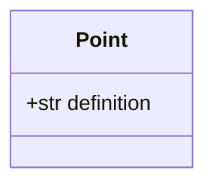
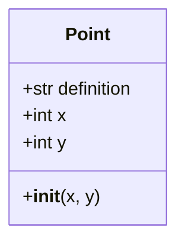
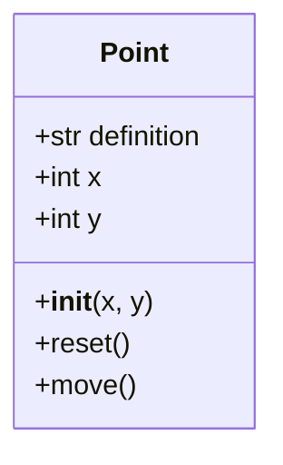
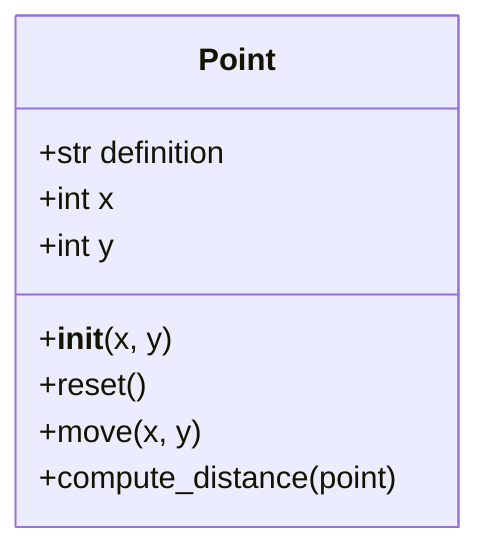
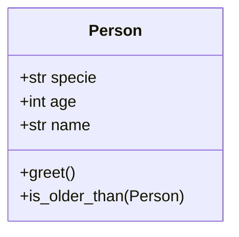

# Programación Orientada a Objetos - UNAL

## Tabla de Contenidos
- [Clase 6: Clases y Objetos](#clase-6-clases-y-objetos)
  - [Objetos](#objetos)
  - [Clases en Python](#clases-en-python)
    - [Atributos](#atributos)
      - [Atributos de clase](#atributos-de-clase)
      - [Atributos de instancia](#atributos-de-instancia)
    - [Inicialización y Self](#inicializacion-__init__-y-el-si-mismo-self)
      - [¿Por qué es necesario self?](#por-qué-es-necesario-self)
      - [¿Cómo funciona self?](#cómo-funciona-self)
    - [Métodos](#métodos)
      - [Objetos como argumentos](#objetos-como-argumentos)
    - [Ejercicios](#ejercicio)

----
## Clase 6: Clases y Objetos

### Objetos
En Python, todo es un objeto, incluidos los datos de tipos primitivos y las estructuras de datos. Un objeto **es una instancia de una clase**, que a su vez es una plantilla para crear objetos (*binded definitions*). Los objetos pueden contener tanto datos (**atributos**) como código (**métodos**).

Pero entonces...¿qué es "instanciar"?...

En el contexto de la programación orientada a objetos en Python, "instanciar" un objeto es el proceso mediante el cual se crea un objeto único a partir de una clase. Una clase puede considerarse como un **plano** o un *template* que define los atributos y métodos que sus objetos (instancias) tendrán. Cuando `instanciamos` un objeto, estamos creando una entidad concreta en la memoria que sigue las especificaciones de su clase respectiva.

Una instancia es, por lo tanto, **un objeto específico creado a partir de una clase**. Cada instancia tiene sus propios atributos (o incluso métodos si se pasan distintos argumentos), que pueden tener diferentes valores que distinguen una instancia de otra. 

**Importante:** A pesar de que múltiples instancias de una misma clase pueden compartir la misma estructura (es decir, los mismos atributos y métodos), los valores de esos atributos pueden variar entre instancias.

Y todo esto para?
<details>
<summary>Spoilers</summary>
<p>
La <b>instanciación</b> es fundamental en la programación orientada a objetos porque permite a los desarrolladores crear múltiples objetos únicos a partir de una sola definición de clase. Esto facilita la <b>reutilización de código y la organización del programa</b>, permitiendo que los objetos interactúen entre sí. Cada objeto puede contener sus propios datos, lo que permite <b>representar entidades del mundo real dentro del código de manera aislada y modular</b>.
</p>
</details>

## Clases en Python
Una clase se define con la palabra clave `class` seguida de un nombre y dos puntos. La clase más simple en Python no necesita nada más que la palabra clave pass para representar un bloque de código vacío.

**Pro tip:** El nombre de las clases debe ir en `CamelCase`, con la primera palabra capitalizada.

```python
class MyFirstClass:
  pass
```

```python
class Point:
  pass
```

**Dato:** `pass` permite definir un bloque de código sin funcionalidad, sin tener el error de que se tiene un bloque no definido.


**Ejercicio:** Probar esto y ver qué pasa...

```python
class Point:
  pass

point = Point()
print(point)
```

### Atributos
En Python, los atributos de una clase son variables asociadas a esta, que definen las **características** de los objetos que se crean a partir de ella.

#### Atributos de clase
Son variables asociadas a la clase misma, no a las instancias de la clase. Estos atributos son compartidos por todas las instancias de la clase. Se definen directamente en el cuerpo de la clase, fuera de cualquier método.



```python
class Point:
  definition: str = "Entidad geometrica abstracta que representa una ubicación en un espacio."

point = Point()
print(point.definition)
```

#### Atributos de instancia
Son variables específicas de cada instancia de una clase. Cada objeto creado a partir de la clase puede tener valores diferentes para estos atributos. Se definen comúnmente dentro del método `__init__`, utilizando el prefijo `self` para indicar que son atributos de instancia.

```python
class Point:
  definition: str = "Entidad geometrica abstracta que representa una ubicación en un espacio."
  def __init__(self, x=0, y=0):
    self.x = x
    self.y = y

point = Point()
print(point.definition, point.x, point.y)
```



### Inicializacion (`__init__`) y el si mismo (`self`)

Instanciar un objeto implica llamar a la clase como si fuera una función, lo que a menudo involucra pasar valores iniciales a su método constructor `__init__`. Este método constructor **inicializa** los nuevos objetos, realizando la configuración inicial, de atributos y métodos.

 - `__init__` es el método de inicialización de un objeto recién creado. Se  utiliza para inicializar los atributos del objeto, es decir, para darles un estado inicial.
 - No devuelve un valor; su propósito es inicializar la instancia: `def __init__(self)->None:`. 
 - Se denomina *dunder* init, porque double underscore, so doble __, pretty neat.

En Python, `self` es un término que se utiliza para referirse a la instancia actual de la clase. En otras palabras, `self` representa al objeto específico que está ejecutando. Este término no es una palabra reservada de Python pero es una convención fuertemente arraigada (como todo en Python).

Cuando se define un método en una clase, el primer argumento del método se refiere a la instancia en la que el método está siendo llamado. Por convención, este primer argumento es `self`. Esto permite acceder a los atributos y métodos del objeto desde dentro de la clase.

Algunos se preguntarán....y esto qué...pues es magia pura, porque después del inicializador se puede compartir todo el objeto con el resto de la clase...y si aún no le ven utilidad, si esto no existiera, para cada método dentro de la clase, habría que estar pasando variables (que representan atributos) a través de argumentos a todos los métodos de la clase, lo cual es super largo y engorroso. La magia del `self`, es esa, proveer autoconciencia, saber qué soy, qué tengo, y qué puedo hacer en cada momento....es **M A G I A**.

**Disclaimer:** En concepto de `self` sería más o menos el equivalente de `this` en Java.

#### ¿Por qué es necesario `self`?
`self` es necesario para diferenciar entre atributos y métodos de la instancia y variables locales o globales. Permite a un objeto referenciar sus propios atributos y métodos dentro de la clase. Sin `self`, no tendríamos una forma de acceder a estos datos desde dentro de los métodos de la clase.

#### ¿Cómo funciona `self`?
- Cuando se crea una instancia de una clase, Python automáticamente pasa la instancia recién creada al método `__init__` como el primer argumento. Este argumento se recibe en el parámetro `self`.
- Para cualquier método de instancia, el objeto sobre el cual se llama el método se pasa automáticamente como el primer argumento, y se recibe en `self`.

### Métodos
Una clase no solo tiene atributos (características) sino también métodos (comportamientos/acciones), estos métodos se definen como funciones dentro de la estructura de la clase. Ya se vió el primer método importante, el inicializador, existen unos cuantos más, pero de momento cualquier funcionalidad que se le quiera atribuir a la clase, es tan simple como agregar más métodos en su interior.




```python
class Point:
  definition: str = "Entidad geometrica abstracta que representa una ubicación en un espacio."
  def __init__(self, x=0, y=0):
    self.x = x
    self.y = y
  def move(self, new_x, new_y):
    self.x = new_x
    self.y = new_y
  def reset(self):
    self.x = 0
    self.y = 0

point = Point(x=1, y=1)
print(point.definition, point.x, point.y)
point.move(new_x=2, new_y=2)
print(point.x, point.y)
point.reset()
print(point.x, point.y)
```

#### Objetos como argumentos...
Como se vio todo en Python son objetos, de manera que los métodos de una clase y la clase en sí pueden recibir argumentos tipo objeto.



```python
class Point:
  definition: str = "Entidad geometrica abstracta que representa una ubicación en un espacio."
  def __init__(self, x: float=0, y: float=0):
    self.x = x
    self.y = y
  def move(self, new_x: float, new_y: float):
    self.x = new_x
    self.y = new_y
  def reset(self):
    self.x = 0
    self.y = 0
  def compute_distance(self, point: "Point")-> float:
    distance = ((self.x - point.x)**2+(self.y - point.y)**2)**(0.5)
    return distance

first_point = Point(x=1, y=1)
second_point = Point(x=2, y=2)
# should be root of 2 (?)
print(first_point.compute_distance(second_point))
```

**Ejercicio:**
Defina una clase siguiendo la siguiente estructura:

 - *specie*: Class attribute
 - *age*, *name*: Instance attributes
 - greet(): should print-> <name>, is gretting you!
 - is_older_than(Person)->bool: Dtermine if the instance person is older than the argument person.

----

### Info adicional
- [Clases - ref de Python](https://docs.python.org/3/tutorial/classes.html) 
- [Clases y objetos en Python](https://realpython.com/python3-object-oriented-programming/) 
- [POO principles in Python - Super Post](https://medium.com/@aserdargun/advanced-oop-in-python-a5f6130da291) 
- [POO with spiderman memes](https://medium.com/@bdov_/https-medium-com-bdov-python-this-is-an-object-that-is-an-object-everything-is-an-object-fff50429cd4b) 


